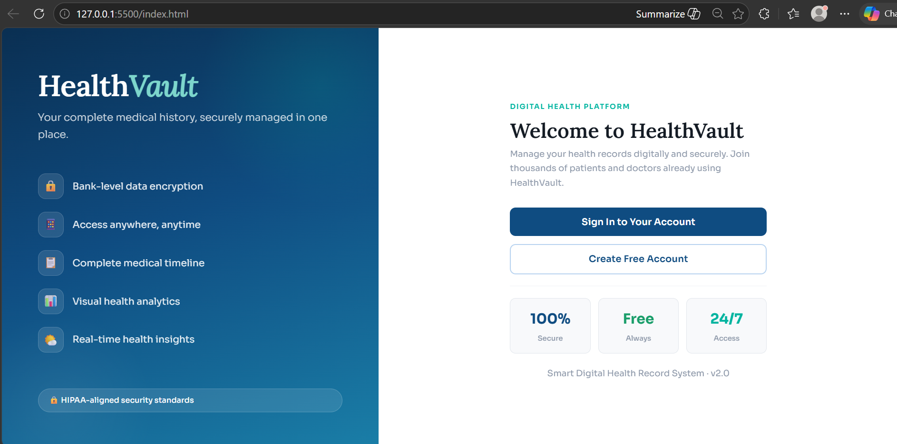
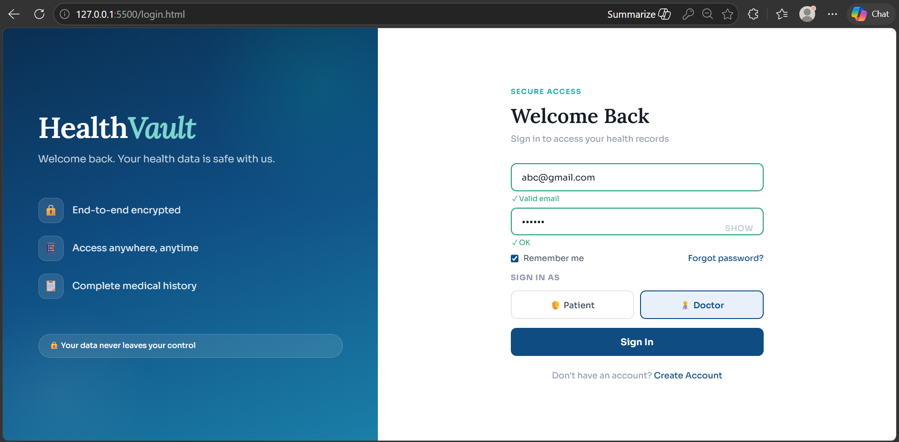
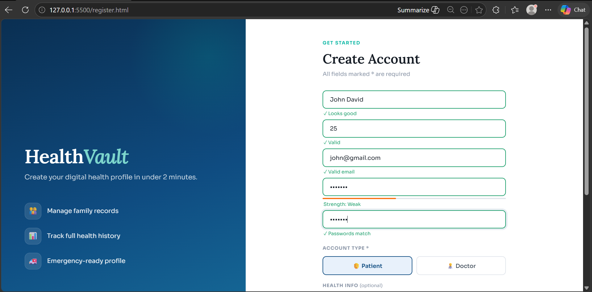
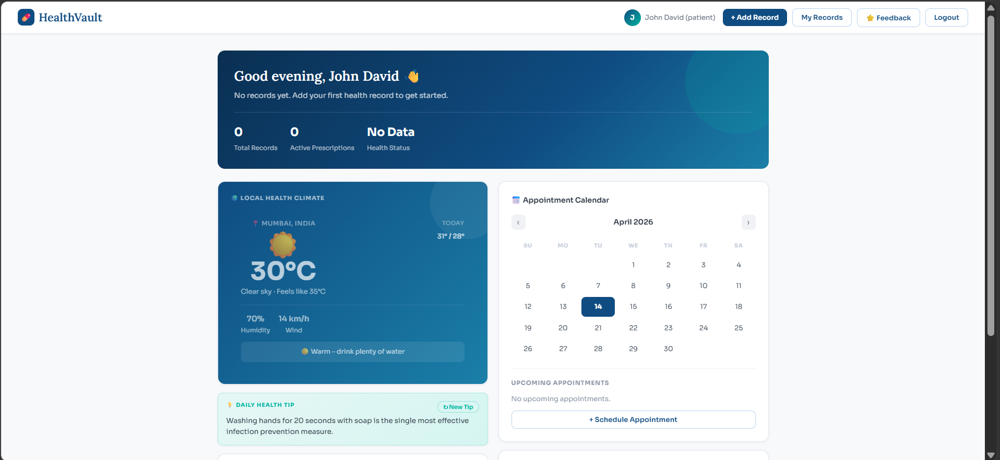
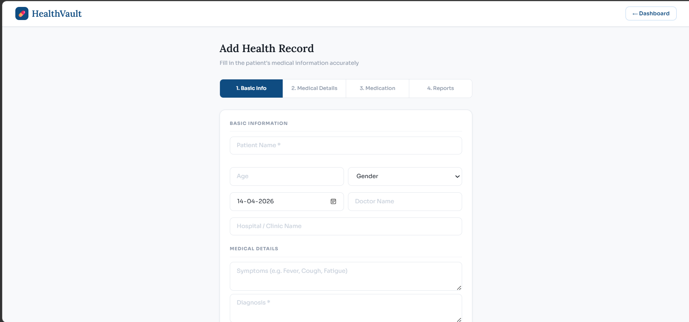
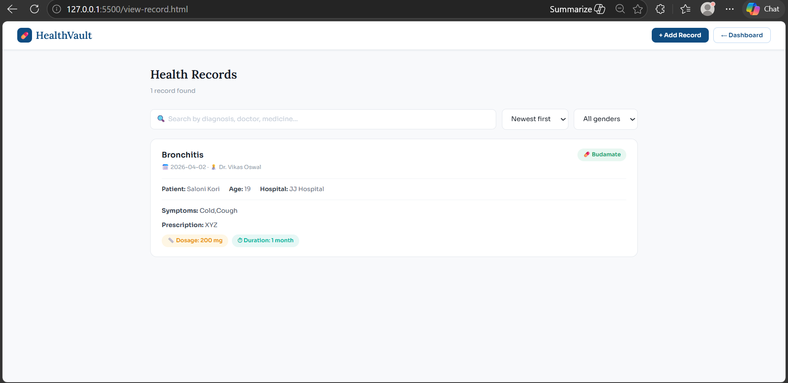
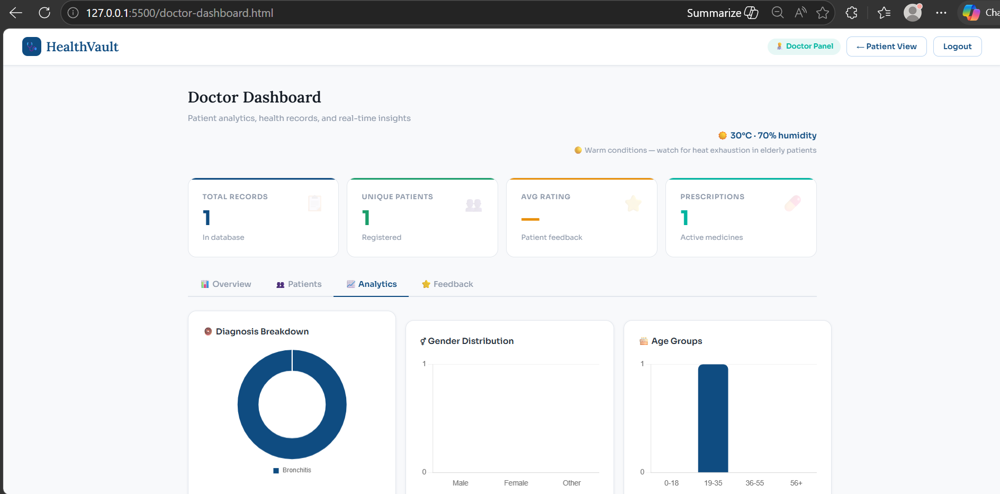

# 🏥 HealthVault – Digital Health Record System

## 📌 Project Overview

**HealthVault** is a web-based Electronic Health Record (EHR) system designed to securely store, manage, and access patient medical records digitally. It allows both patients and doctors to interact with medical data through an intuitive and user-friendly interface.

The system provides a centralized platform where users can store health records, track medical history, and access insights for better healthcare management.

---

## ✨ Features

- 🔐 Secure Login & Registration
- 📋 Digital Medical Records Management
- 🧑 Patient Dashboard with Health Summary
- 👨‍⚕️ Doctor Dashboard with Analytics
- 🔍 Search, Filter & Sort Records
- 💊 Medication Tracking
- 📅 Appointment Management
- 🌤️ Health Insights (Weather-based UI)

---

## 🏗️ System Architecture

### 🔹 Technology Stack

- **Frontend:** HTML, CSS, JavaScript
- **Backend:** Node.js (Express.js)
- **Database:** SQLite

### 🔹 Architecture Flow

```
User (Browser)
       ↓
Frontend (HTML, CSS, JS)
       ↓ (API Requests - Fetch)
Backend (Node.js + Express)
       ↓
SQLite Database
```

---

## 🧩 Modules Description

### 1️⃣ Authentication Module

- Login functionality for patients and doctors
- Registration with validation (email, password, etc.)
- Role selection (Patient / Doctor)

---

### 2️⃣ Patient Dashboard Module

- Displays:
  - Health summary
  - Total records
  - Active prescriptions
  - Appointment calendar
- Provides quick actions:
  - Add Record
  - View Records
  - Feedback

---

### 3️⃣ Doctor Dashboard Module

- Displays:
  - Total records
  - Number of patients
  - Feedback ratings
  - Medicine usage
- Analytics:
  - Diagnosis trends
  - Patient demographics
  - Records over time

---

### 4️⃣ Add Record Module

- Multi-step form including:
  - Basic Information (Name, Age, Gender)
  - Medical Details (Symptoms, Diagnosis)
  - Medication (Medicine, Dosage)
  - Reports & Notes

---

### 5️⃣ View Record Module

- Features:
  - Search by diagnosis, doctor, etc.
  - Filter by gender
  - Sort by newest/oldest
  - Role-based access (Patient sees own data)

---

### 6️⃣ Database Module

- SQLite Database: `healthvault.db`

#### Tables:

- **Users**
- **Records**
- **Appointments**
- **Feedback**

---

## 🔌 APIs Used / Integrated

### 📡 Backend APIs

| Endpoint | Method | Description |
|----------|--------|-------------|
| `/register` | POST | Register new user |
| `/login` | POST | Authenticate user |
| `/records` | GET | Fetch health records |
| `/records` | POST | Add new record |

### 🌐 Other Integrations

- Local Storage (for session management)
- Fetch API (frontend-backend communication)
- **Weather API**  [OpenWeatherMap](https://openweathermap.org/api) 
   Fetches real-time weather data based on the user's location to provide contextual health insights and adapt the dashboard UI accordingly (e.g., alerts for extreme temperatures or high pollution) 

---

## ⚠️ Challenges & Solutions

| Challenge | How It Was Addressed |
|-----------|----------------------|
| SQLite integration with Node.js | Used the `better-sqlite3` package for synchronous DB operations |
| Authentication & session handling | Implemented validation middleware and Local Storage-based session tokens |
| Role-based access control | Conditional rendering and server-side filtering based on user role |
| Fetch API communication | Standardized JSON request/response format across all endpoints |
| Weather API integration | Used geolocation API to dynamically fetch city-based weather |
| Responsive UI design | CSS Flexbox/Grid layout with media queries |

---

## 👥 Team Contributions

| Team Member | Contribution |
|-------------|--------------|
| **Diksha Khamkar** | Home Page (`index.html`) & Login Page (`login.html`) |
| **Ruth Jacob** | Register Page (`register.html`) & Dashboard (`dashboard.html`) |
| **Ann Davidson** | Add Record (`add-record.html`) & View Record (`view-record.html`) |
| **Saloni Kori** | CSS (`style.css`), JavaScript, Backend (`server.js`), Database |

---

## 📸 Screenshots

> Screenshots are located in the `screenshots/` folder.

| Page | Preview |
|------|---------|
| Home Page |  |
| Login |  |
| Register |  |
| Patient Dashboard |  |
| Add Record |  |
| View Records |  |
| Doctor Dashboard |  |

---


## 🛠️ Installation & Setup

### 1️⃣ Clone Repository

```bash
git clone [github.com](https://github.com/your-username/healthvault.git)
cd healthvault
```

### 2️⃣ Install Dependencies

```bash
npm install
```

### 3️⃣ Run Server

```bash
npm start
```

### 4️⃣ Open in Browser

```
[localhost](http://localhost:3000)
```

---

## 📁 Project Structure

```
healthvault/
│── index.html
│── login.html
│── register.html
│── dashboard.html
│── doctor-dashboard.html
│── add-record.html
│── view-record.html
│── style.css
│── server.js
│── healthvault.db
└── package.json
```

---

## 🚀 Future Enhancements

- 🔒 JWT Authentication
- ☁️ Cloud Database (MongoDB/Firebase)
- 📱 Mobile Responsive UI
- 📊 Advanced Analytics Dashboard
- 🧾 Export Reports (PDF)
- 🔔 Notifications & Reminders

---

## 📌 Conclusion

**HealthVault** is a complete full-stack web application that digitizes healthcare record management. It demonstrates practical implementation of frontend, backend, and database integration, providing a real-world solution for managing medical data securely and efficiently.

---

## 📄 License

This project is developed for academic purposes only.
